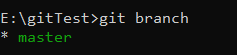

# Test Git Projekt

## Installation prüfen
````bash
git --version
````

### Git konfigurieren
Damit in Gitpush und pull Kommandos ausgreführt werden können, bzw Änderungen mit commit bestätigt werden können, muss ein Autor mit einer Email Adresse definiert werden.
````bash
git config --global user.mail "a.naegele@hgs-singen.online"
git config --global user.name "Arne1509"
````

## Projekt für Git initialisieren
Erstellen sie auf ihrem PC lokal einen Ordner in welchem ein Projekt erstellt werden soll. Überprüfen sie anschließend den Status des Projekts. 
````bash
D:
mkdir Projektordner
cd "Projektordner"
git init 
git status
````

## Hinzufügen von Dateien und Ordnern
Alle Dateien die mit git überwacht werden sollen, müssen über den ``git add`` dem Repository hinzugefügt werden. 
````bash
git add Readme.md
git status
````
## Hilfe
````bash
git --help
git
````
## Erster Commit
Sollen Dateien die verändert wurden in das Repository übernommen werden, müssen die Änderungen mit ``git commit -m "message"`` bestätigt werden.
## Branch
Nachdem der erste commit durchgeführt wurde, werden die entsprechenden Dateien dem master branch hinzugefüft. Wir zeigen alle Branches mit folgendem Kommando an
````bash
git branch
````



## Umbennen des Master-Branches
Der folgende Befehl benennt den Master Branch in ```main``ùm
````bash
git branch -M main
````